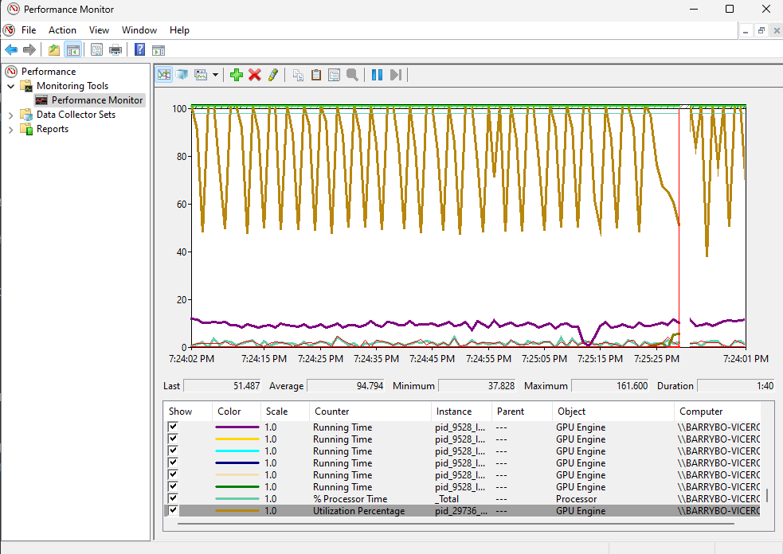
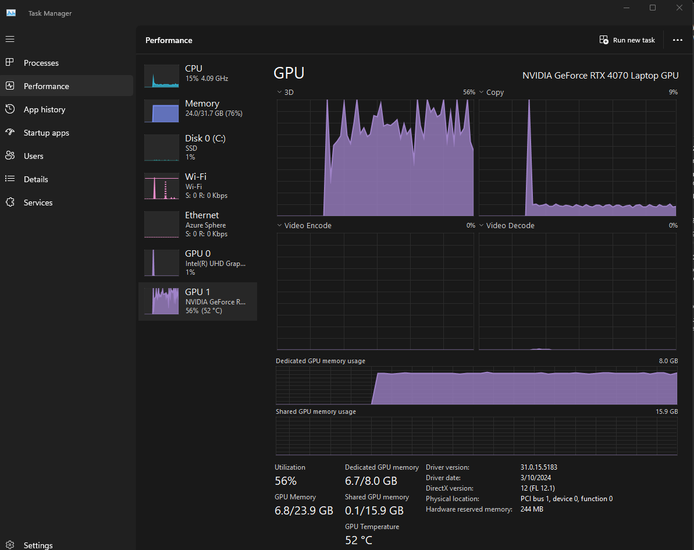

barrybo@BARRYBO-VICEROY:~/testLLM$ python3 test_selection/data_analysis.py     --data_path data/code_alpaca_2k.json     --save_path alpaca_data_pre.pt     --model_name_or_path microsoft/Phi-3-mini-4k-instruct     --max_length 512     --prompt alpaca     --mod pre

Namespace(data_path='data/code_alpaca_2k.json', save_path='alpaca_data_pre.pt', model_name_or_path='microsoft/Phi-3-mini-4k-instruct', max_length=512, start_idx=0, end_idx=-1, prompt='alpaca', mod='pre')

model-00002-of-00002.safetensors: 100%|████████████████████████████████████████████| 2.67G/2.67G [02:55<00:00, 11.3MB/s]

Downloading shards: 100%|█████████████████████████████████████████████████████████████████| 2/2 [02:55<00:00, 87.86s/it]

Loading checkpoint shards: 100%|██████████████████████████████████████████████████████████| 2/2 [00:03<00:00,  1.84s/it]

generation_config.json: 100%|██████████████████████████████████████████████████████████| 181/181 [00:00<00:00, 2.00MB/s]

WARNING:root:Some parameters are on the meta device device because they were offloaded to the cpu.

tokenizer_config.json: 100%|███████████████████████████████████████████████████████| 3.44k/3.44k [00:00<00:00, 56.8MB/s]

tokenizer.model: 100%|███████████████████████████████████████████████████████████████| 500k/500k [00:00<00:00, 12.7MB/s]

tokenizer.json: 100%|██████████████████████████████████████████████████████████████| 1.94M/1.94M [00:00<00:00, 9.13MB/s]

added_tokens.json: 100%|███████████████████████████████████████████████████████████████| 306/306 [00:00<00:00, 4.44MB/s]

special_tokens_map.json: 100%|█████████████████████████████████████████████████████████| 599/599 [00:00<00:00, 7.95MB/s]

Special tokens have been added in the vocabulary, make sure the associated word embeddings are fine-tuned or trained.

  0%|                                                                                          | 0/2017 [00:00<?, ?it/s]We detected that you are passing `past_key_values` as a tuple and this is deprecated and will be removed in v4.43. Please use an appropriate `Cache` class (https://huggingface.co/docs/transformers/v4.41.3/en/internal/generation_utils#transformers.Cache)

You are not running the flash-attention implementation, expect numerical differences.

100%|███████████████████████████████████████████████████████████████████████████████| 2017/2017 [47:59<00:00,  1.43s/it]

New data len: 2017

Time Used: 47.9855712334315 (min)

python test_selection/data_by_cluster.py \

    --pt_data_path alpaca_data_pre.pt \

    --json_data_path data/code_alpaca_2k.json \

    --json_save_path alpaca_data_pre.json \

    --sample_num 10 \

    --kmeans_num_clusters 100 \

    --low_th 25 \

    --up_th 75

 

 

Namespace(pt_data_path='alpaca_data_pre.pt', json_data_path='data/code_alpaca_2k.json', json_save_path='alpaca_data_pre.json', sent_type=0, ppl_type=0, cluster_method='kmeans', reduce_method='tsne', sample_num=10, kmeans_num_clusters=100, low_th=25, up_th=75)

100%|████████████████████████████████████████████████████████████████████████████████████████████████████████████████| 2017/2017 [00:00<00:00, 333224.80it/s]

New data len

774

 

 

This finished in a second or two.

 

 

barrybo@BARRYBO-VICEROY:~/testLLM$ python test_selection/data_analysis.py \

    --data_path data/code_alpaca_2k.json \

    --save_path alpaca_data_cherry.pt \

    --model_name_or_path microsoft/Phi-3-mini-4k-instruct \

    --max_length 512 \

    --prompt alpaca \

    --mod cherry

Namespace(data_path='data/code_alpaca_2k.json', save_path='alpaca_data_cherry.pt', model_name_or_path='microsoft/Phi-3-mini-4k-instruct', max_length=512, start_idx=0, end_idx=-1, prompt='alpaca', mod='cherry')

Loading checkpoint shards: 100%|███████████████████████████████████████████████████████████████████████████████████████████████| 2/2 [00:04<00:00,  2.01s/it]

WARNING:root:Some parameters are on the meta device device because they were offloaded to the cpu.

Special tokens have been added in the vocabulary, make sure the associated word embeddings are fine-tuned or trained.

  0%|                                                                                                                               | 0/2017 [00:00<?, ?it/s]We detected that you are passing `past_key_values` as a tuple and this is deprecated and will be removed in v4.43. Please use an appropriate `Cache` class (https://huggingface.co/docs/transformers/v4.41.3/en/internal/generation_utils#transformers.Cache)

You are not running the flash-attention implementation, expect numerical differences.

100%|██████████████████████████████████████████████████████████████████████████████████████████████████████████████████| 2017/2017 [1:30:26<00:00,  2.69s/it]

New data len: 2017

Time Used: 90.44084089199701 (min)

